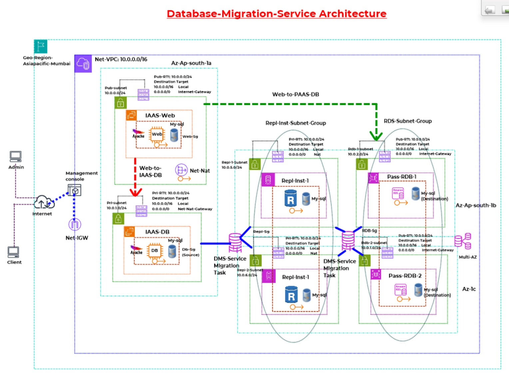
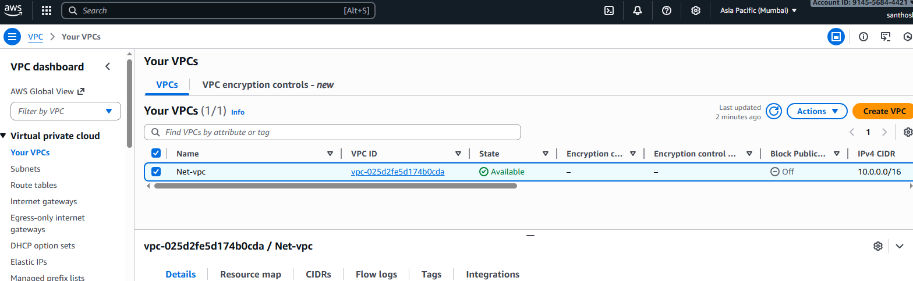
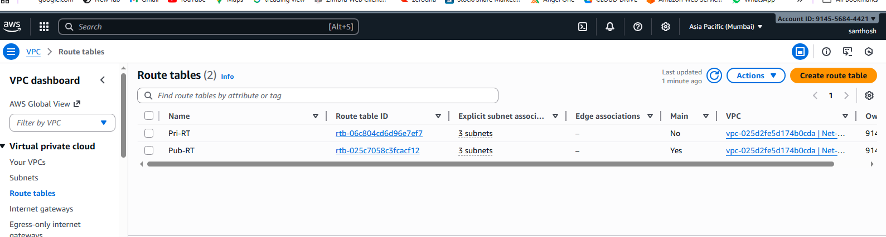
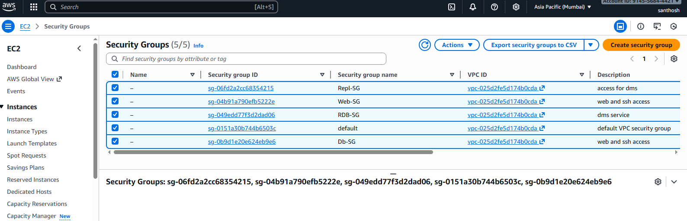

# AWS Database Migration Project (EC2 → RDS Using AWS DMS)

This project demonstrates migration of a MySQL database from an EC2 instance (source) to Amazon RDS (target) using AWS Database Migration Service (DMS).  
Includes VPC setup, networking, security groups, MySQL installation, PHP application deployment, and migration verification.



---

## 1. VPC & Networking Setup

### Created VPC  
CIDR: 10.0.0.0/16


### Created Subnets  
- Public Subnet: Web-Pub-Subnet  
- Private Subnets: Db-Pri-Subnet, Repl-Pri-Subnet
-   

### Created Route Tables  
- Public Route Table → Internet Gateway  
- Private Route Table → No IGW
- 


  

### Images  
  
  


---

## 2. Security Groups

### Web-SG
- Allow SSH (22)  
- Allow HTTP (80)

### DB-SG
- Allow MySQL 3306 from Web-SG  
- Allow MySQL 3306 from DMS-SG

### RDS-SG
- Allow 3306 from DB-SG

### DMS-SG
- Allow communication between DB and RDS

### Image  


---

## 3. MySQL Setup on EC2 (Source Database)

### Install MySQL
```bash
sudo apt update
sudo apt install mysql-server -y


```

### Set root password:
```sql
ALTER USER 'root'@'localhost'
IDENTIFIED WITH mysql_native_password BY 'Sqladmin2025';
```

---

## 4. Create Database and Table

```sql
CREATE DATABASE appdb;
USE appdb;

CREATE TABLE Course (
   CourseID INT,
   CourseName VARCHAR(1000),
   Rating NUMERIC(2,1)
);
```

### Insert Sample Data
```sql
INSERT INTO Course VALUES
(1,'AWS Certified Solutions Architect - Associate',4.5),
(2,'AWS Certified Solutions Architect - Professional',4.6),
(3,'AWS Certified DevOps Engineer - Professional',4.7);
```

---

## 5. Allow Remote MySQL Access

### Edit MySQL Config
```bash
sudo nano /etc/mysql/mysql.conf.d/mysqld.cnf
```

### Update bind-address:
```
bind-address = 10.0.1.212
```

### Restart MySQL
```bash
sudo systemctl restart mysql
```

---

## 6. Install Apache, PHP, MySQL Module

```bash
sudo apt update
sudo apt install apache2 php php-mysql -y
sudo systemctl restart apache2
```

---

## 7. Upload PHP Application (FileZilla)

Upload to:
```
/var/www/html/
```

---

## 8. Test Web Application

Open:
```
http://<webserver-public-ip>/index.php
```

---

## 9. Create RDS MySQL Instance

- DB Identifier: aws-rds-db  
- DB Subnet Group: RDS-subnet-groups  
- Security Group: RDS-SG  

---

## 10. Configure AWS DMS

### Replication Instance  


### Endpoints  


---

## 11. Create Full Load Migration Task

Status:
```
Load Completed (100%)
```


---

## 12. Verify Migrated Data in RDS

Run:
```sql
SELECT * FROM appdb.Course;
```


---

## 13. Verify EC2 → RDS Connectivity


---

## Conclusion

- VPC + Subnets configured  
- EC2 Web & DB servers created  
- MySQL installed and configured  
- Apache + PHP deployed  
- RDS instance created  
- AWS DMS migration completed  
- Data verified in RDS  
- End-to-end cloud migration successful  

